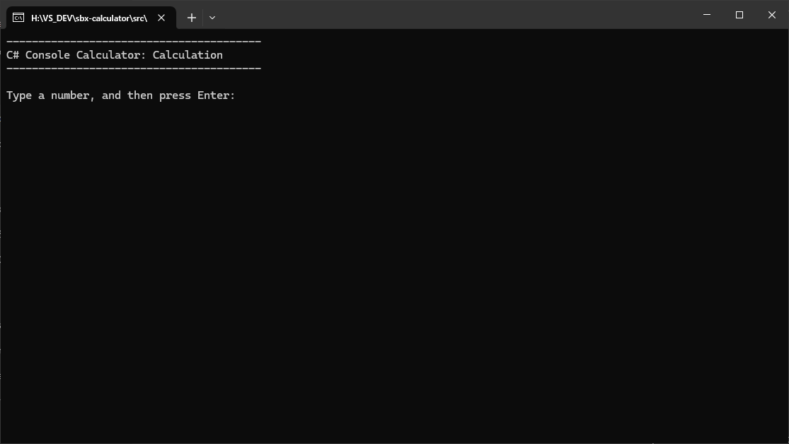

<h1>Calculator</h1>

Welcome to **Calculator**!

This project was built for demonstration purposes, with anyone with a need to do a calculation as the target audience.
It aims to support the solving of mathmatical operations, and maintain an in-memory history of calculations performed, as well as a JSON file upon exit.
It currently is launched via Console Application.

## Features

- **New Calculation**

	Allows the user to input numbers, choose an operation and then get the result of the calculation.

- **Recall Result**
 
	Choose a result from a previous calculation to use in a new calculation.

- **View History**

	Displays any previous calculation held in-memory.

- **Clear History**

	Clears any in-memory calculations.

- **Supported Operations**:

	Add, Subtract, Multiply, Divide, Square Root, Exponentiation, Power, Sine, Cosine, Tangent.

- **Persistent Storage**:

	On exit, any calculations performed are saved to a JSON file in the application directory.
 
## Getting Started

### Prerequisites

- .NET 8 SDK installed on your system.
- A code editor like Visual Studio or Visual Studio Code

### Installation

1. Clone the repository:
	- `git clone https://github.com/cjc-sweatbox/calculator.git`

2. Navigate to the project directory:
	- `cd src\calculator\CalculatorProgram`

3. Build the project:
	- `dotnet build`

### Running the Application

1. Run the application using the .NET CLI in the project directory:
	- `dotnet run`

## Usage

### Console

When you start the application, you will be presented with the main menu:

Choose an option:
- **N**: to perform a new calculation.
- **R**: to recall a result from the list of calculations stored in-memory, and then perform a new calculation.
- **V**: to view the list of calculations stored in-memory.
- **C**: to clear the list of calculations stored in-memory.
- **Q**: to quit the application.

If you choose `N` at the **Main Menu**, you will then be presented with the Calculation page:
    

Input a first number, choose a operation, and depending on the operation you may have to input a second number.
NOTE: All input is validated, and any invalid input will be rejected.

After the calculation has been entered, you will be shown the result.

If you choose `R` at the **Main Menu**, you will then be presented with the Recall page:
    

Input the ID of the calculation you want to recall, after which you will be taken to the calculation page, with the first number pre-populated with the selection.

If you choose `V` at the **Main Menu**, you will then be presented with the History page:
    

If you choose `C` at the **Main Menu**, the history will be cleared and you will then be presented with the following message:
    

If you choose `Q` at the **Main Menu**, the application will exit and a JSON file will be written to the application directory:

## How It Works

- **Menu Navigation**: Navigate through the menu using the provided options to set up your calcuation.
- **Calculator**: Creates a json file, performs calculations, records history, closes json file.

## Contributing

Contributions are welcome! Please fork the repository and create a pull request with your changes. For major changes, please open an issue first to discuss what you would like to change.

## License

This project is licensed under the MIT License. See the [LICENSE](./LICENSE) file for details.

## Contact

For any questions or feedback, please open an issue.

---
***Happy Calculating!***
